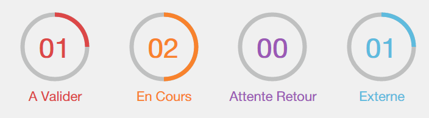

# circlestat
A simple animated circle chart library based on Raphael.JS

Browser compatibility: Firefox 3.0+, Safarie 3.0+, Chrome 5.0+, Opera 9.5+ and Internet Explorer 6.0+;



## Initialization

```html
<script type="text/javascript" src="js/vendors/raphael.min.js"></script>
<script type="text/javascript" src="js/lib/circlestat.min.js"></script>
```

## Html

```html
<div id="circleStat-views" class="circleStat">
    <span class="circleStat-pourcent">54</span>
    <span class="circleStat-title">Views</span>
</div>
```

## Javascript

```js
window.onload = (function() {
    
    var params = {
        container: 'circleStat-views'
        strokeWidth: '10',
        strokeColor: '#1E8548'
    };

    var myStat = new CircleStat(params);
    myStat.draw();

})();
```

## Parameters

- `container`: 
- `strokeWidth`: 
- `strokeColor`:
- `bgColor`: 
- `containerColor`:
- `width`: 
- `height`:
- `speed`: 
- `pourcent`: